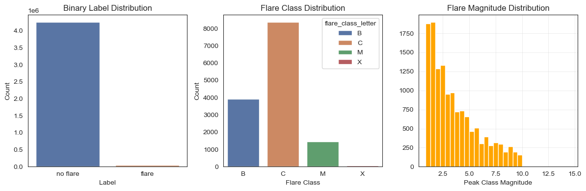
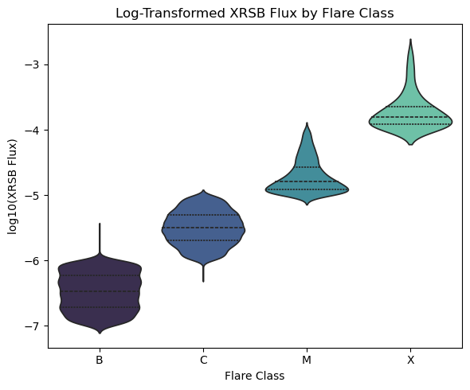
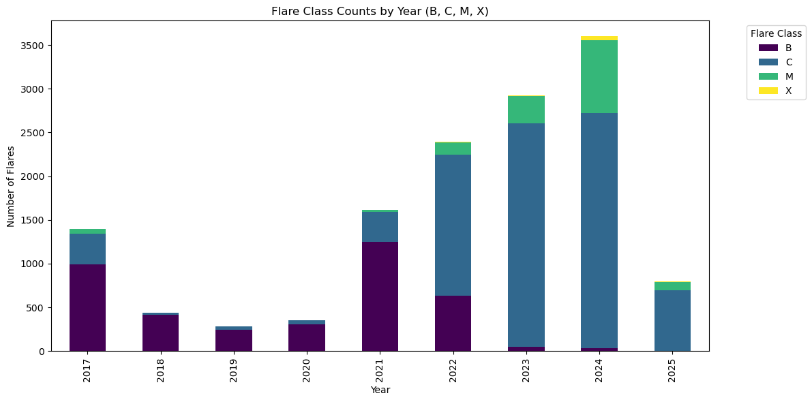
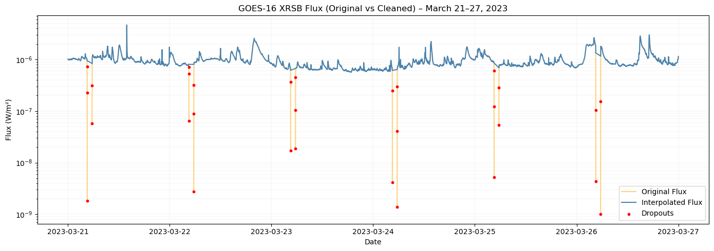
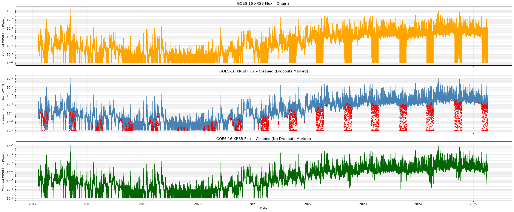

# Solar Flare Prediction from GOES-16 X-ray Flux Data
Processes GOES-16 satellite X-ray flux measurements to predict the occurrence of solar flares over future time horizons (6h, 12h, 18h, 24h, 48h, 72h) using forest and gradient models. 

Includes the full data science pipeline: preprocessing, feature engineering, exploratory analysis, and time series classification.

---

## Repository Structure

| Notebook | Purpose |
|:---------|:--------|
| **01_preprocessing.ipynb** | Download, clean, and label the GOES-16 flux data, handling equinox eclipse dropouts and aligning flare events. |
| **02_feature_engineering.ipynb** | Add time-series features (e.g., gradients, rolling statistics, lag features) and create future flare target labels. |
| **03_EDA.ipynb** | Visualize label distributions, time-series patterns, feature correlations, and flare characteristics. |
| **04_timeseries_classification.ipynb** | Train and evaluate XGBoost and Random Forest models for predicting future solar flare events. |

---

## Datasets & Figures

- **Flux Data**:  
  NOAA GOES-16 XRSF-L2 Average 1-Minute X-ray Flux  
  [Source](https://data.ngdc.noaa.gov/platforms/solar-space-observing-satellites/goes/goes16/l2/data/xrsf-l2-avg1m_science/)

- **Flare Label Data**:  
  NOAA GOES-16 XRSF-L2 Flare Summary  
  [Source](https://data.ngdc.noaa.gov/platforms/solar-space-observing-satellites/goes/goes16/l2/data/xrsf-l2-flsum_science/)

Fig. 03: Data distributions:


Fig. 04: Distribution of solar flare flux magnitude, by class:


Fig. 05: Count of solar flares by year & class:


---

## XGBoost Model Results
#### (Weighted Averages)

| Prediction Horizon | Accuracy | Precision | Recall | F1-Score | ROC AUC |
|:-------------------|:---------|:----------|:-------|:---------|:---------|
| 6 hours   |   .86     |    .87     |   .85     |   .85     |   .923    |
| 12 hours  |   .88     |    .89     |   .88     |   .88     |   .943    |
| 18 hours  |   .90     |    .90     |   .90     |   .90     |   .951    |
| 24 hours  |   .90     |    .90     |   .90     |   .90     |   .960    |
| 48 hours  |   .92     |    .92     |   .92     |   .92     |   .973    |
| 72 hours  |   .91     |    .92     |   .91     |   .92     |   .971    |

---

# Details
### Preprocessing
GOES-16 is a satellite that captures X-ray flux data from the sun. The satellite launched in late 2016 and captures X-ray flux data every minute. It captures four times at the same time each minute, so it was important that duplicate data be removed. 

The most problematic feature of the data was the eclipses. Around the equinoxes, the GOES-16 satellite's orbit crosses Earth's shadow for a couple of hours at a time in the mornings (approx. 4-6 AM, changing depending on the day). This means that there are huge dips in data that have to be algorithmically accounted for. So, any data points that met the following requirements were interpolated over:

- Is in February, March, April, August, September, or October
- Flux value is < (Daily median) - (Daily IQR)
- Lasts between 2 and 150 minutes
- Is between 4 and 6 AM

Fig. 01 shows the result of this detection and interpolation over the course of a week:


Fig. 02 shows the same, over the entire dataset:


---

### Feature Engineering
In order to perform time series classification using gradient- and forest-based models, we needed to compute lag features. Additionally, a few other features were computed, all of which can be studied in the code block blow:

```python
# lag features for time-series data
selected_lags = [1, 2, 3, 5, 10, 15, 30, 60, 90, 120, 180, 240, 300]
for lag in selected_lags:
    df[f"xrsb_flux_lag_{lag}"] = df["xrsb_flux"].shift(lag).astype(np.float32)

# log-transformed flux column... "
df["xrsb_flux_log"] = np.log10(df["xrsb_flux"].replace(0, np.nan)).fillna(-10)

# 5 minute rolling difference (the difference in flux from 5 minutes ago)..."
df["flux_diff_5min"] = df["xrsb_flux"].diff(periods=5)

# flux rate of change (gradient)...", end ="")
df["flux_rate"] = df["xrsb_flux"].diff().fillna(0)

# gradient change of flux (second derivative of flux curve)..."
df["flux_acceleration"] = df["flux_rate"].diff().fillna(0)

# 5 minute rolling maximum window (the max jump in flux over the last 5 minutes)..."
df["flux_max_diff_5min"] = df["xrsb_flux"].rolling(window=5).apply(lambda x: x.max() - x.min(), raw=True)

# mean, min, max, and standard deviation over last 5/15/30/60 minutes..."
for window in [5, 15, 30, 60]:
    df[f"rolling_avg_{window}min"] = df["xrsb_flux"].rolling(window=window, min_periods=1).mean()
    df[f"rolling_min_{window}min"] = df["xrsb_flux"].rolling(window=window, min_periods=1).min()
    df[f"rolling_max_{window}min"] = df["xrsb_flux"].rolling(window=window, min_periods=1).max()
    df[f"rolling_std_{window}min"] = df["xrsb_flux"].rolling(window=window, min_periods=1).std()

# flux above background flag (binary, if flux is above NOAA-defined background threshold)...
df["flux_above_background"] = (df["xrsb_flux"] > 1e-6).astype(int)

# flux rising (binary) & streak (how many minutes in a row flux has been rising)...
df["flux_rising"] = (df["xrsb_flux"].diff() > 0).astype(int)
df["rising_streak"] = df["flux_rising"] * (
    df["flux_rising"].groupby((df["flux_rising"] != df["flux_rising"].shift()).cumsum()).cumcount() + 1
)
```

The actual target features have to be computed as well. If a classification model spits out that it believes there will be a flare in the next 24 hours, it cannot actually go check over the next 24 hours to see if it's correct. 

To work around this, each row (representing a minute) is given new target columns, whose values are binary, representing whether or not there will be a solar flare in the next x amount of hours. This allows each row to "look ahead" without actually looking ahead.

```python
# Defines time windows (in minutes)
future_windows = {
    "6h": 6 * 60,
    "12h": 12 * 60,
    "18h": 18 * 60,
    "24h": 24 * 60,
    "48h": 48 * 60,
    "72h": 72 * 60
}

# Computes rolling max (0 or 1) and assign as new columns
for label, window in future_windows.items():
    print(f" - flare_in_next_{label} (window={window} min)")
    future_flare = (
        pd.Series(flare)
        .rolling(window=window, min_periods=1) # slides the window
        .max() # checks to see if any 1s (flares) in the window
        .fillna(0) # edge cases at the beginnings and ends of series
        .astype(int) # won't work without this (idk why)
        .values[::-1] # flips data back to forward time
    )
    df[f"flare_in_next_{label}"] = future_flare
```

### Future improvements
- Hyperparameter optimization
- Deep learning approaches (LSTM, Neural network models)
- Incorporating SHARP data

All raw and labeled data are sourced from the NOAA Space Weather Prediction Center (SWPC).  
Special thanks to NOAA for providing open access to high-quality space weather data.